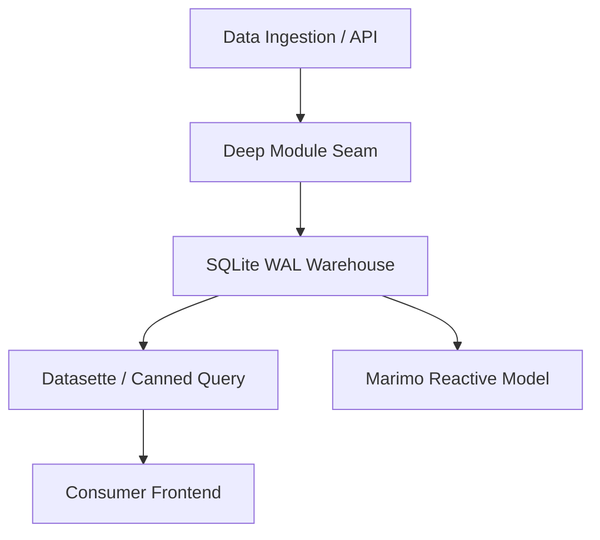

# Implementation Plan: [Feature Name]

> **Spec Reference:** `[Link to spec.md]`  
> **Plan Status:** `Proposed` | `Under Review` | `Approved`  
> **Constitutional Compliance:** [ ] Passed all 6 Articles of `.specify/constitution.md`

---

## 1. Constitutional & Architectural Verification

Before proposing technical changes, verify adherence to non-negotiables:
- [ ] **SQLite WAL Mode (Article III)**: Does this preserve concurrent, non-blocking reads for Datasette and Marimo?
- [ ] **Deep Module Seam (Article III)**: Are changes isolated behind `Warehouse`, `MandiRegistry`, `VolatilityEngine`, or `CommoditySource`?
- [ ] **Data Reality (Article IV)**: Are all synthetic/mock calculations explicitly labeled and prevented from leaking into empirical tables?
- [ ] **Ubiquitous Language (Article II)**: Are terms like *Mandi*, *Arrival*, *Modal Price*, and *LGD Code* used strictly?
- [ ] **Dual-Mode UI (Article V)**: Does the frontend satisfy the anti-slop design system and Household/Bulk mode requirements?

---

## 2. Technical Architecture & Component Changes



### Proposed File Modifications & Additions

#### [Component: Data Layer / Warehouse]
- `[NEW / MODIFY] src/...`: Description of schema additions or query optimizations.

#### [Component: Domain Engine / Mathematical Logic]
- `[NEW / MODIFY] src/volatility.py`: Mathematical functions, statistical formulas.

#### [Component: Presentation / Notebook / Web]
- `[NEW / MODIFY] notebooks/...` or `frontend/...`: UI components, Marimo reactive cells.

---

## 3. Schema & Migration Details (If Applicable)

```sql
-- DDL definition or migration snippet
```

---

## 4. Performance & Complexity Analysis
- **Query Complexity**: [e.g., $O(N)$ scan, indexed on `(commodity, date, mandi_id)`]
- **Storage Impact**: [Estimated bytes per daily ingest]
- **Concurrency Impact**: [Zero locks on WAL readers]

---

## 5. Risk Assessment & Rollback Plan
- **Primary Risk**: [e.g., Unresolved mandi strings during ingestion]
- **Mitigation**: [Staging quarantine table with fallback]
- **Rollback Procedure**: [How to revert safely]
